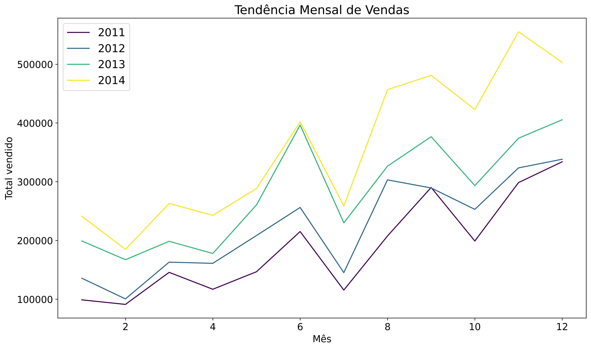
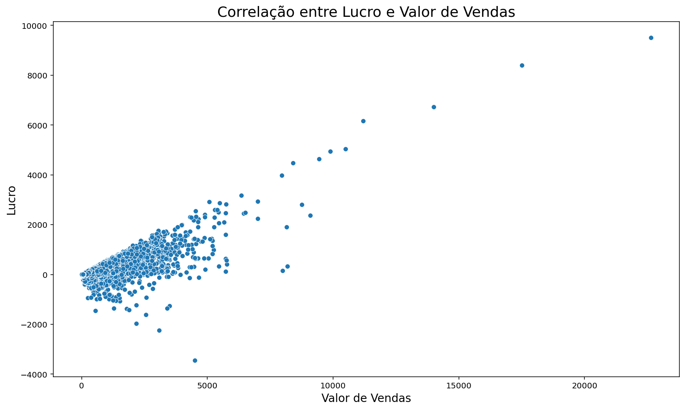
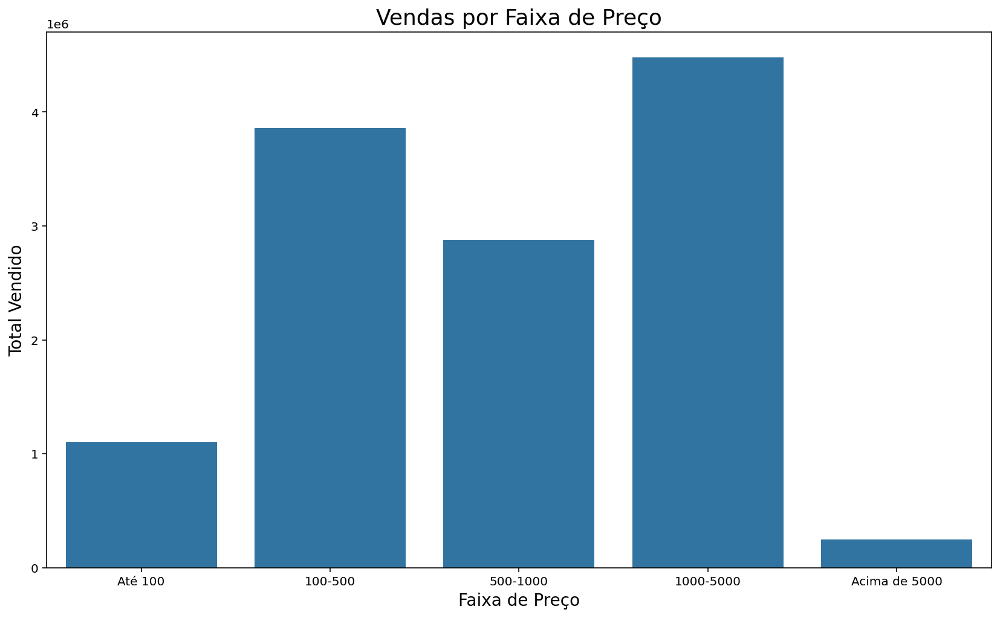
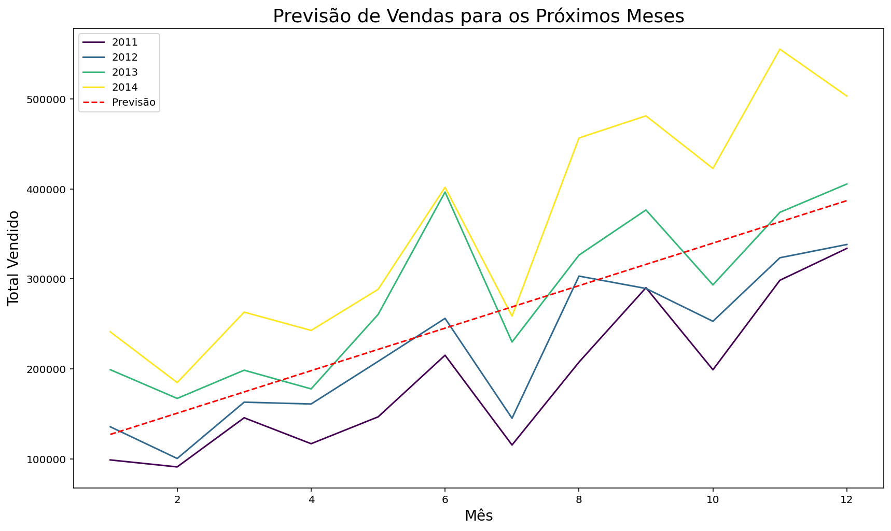
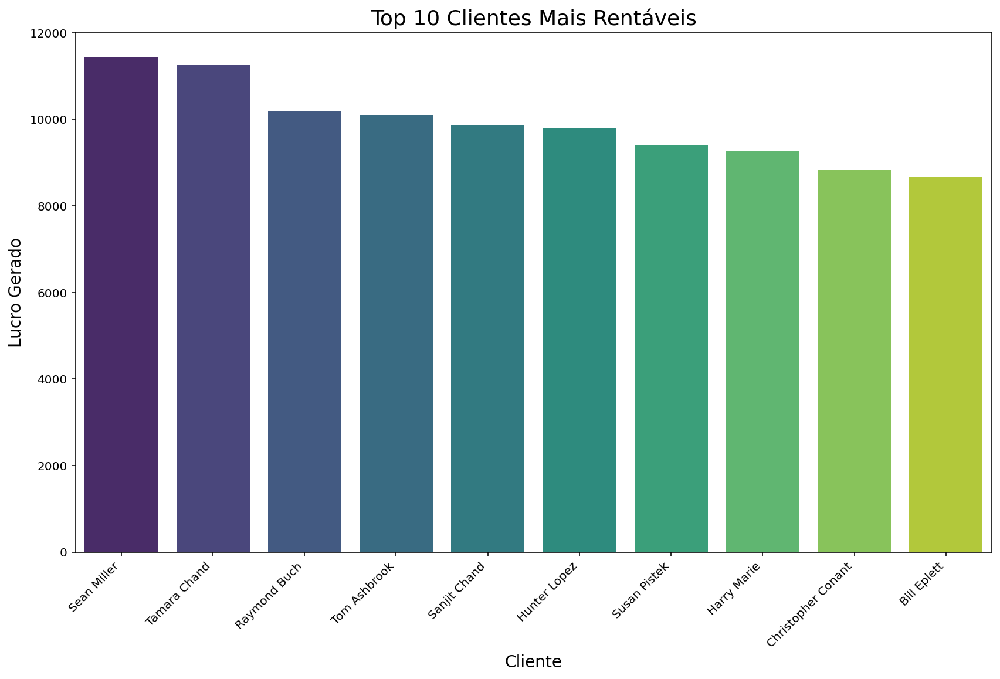
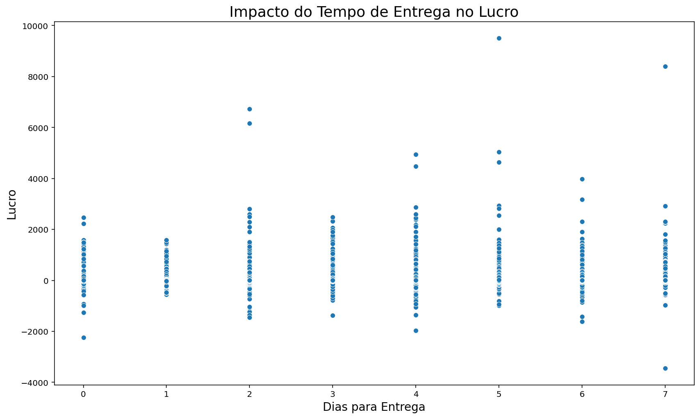
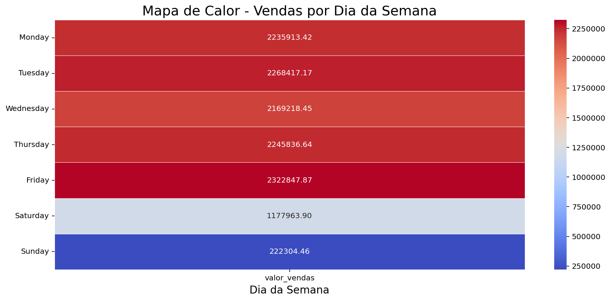

# Sales Analysis: Insights and Strategic Recommendations

This document presents an in-depth analysis of the sales data from the "Sales Data Analysis" project, translating the generated visualizations into actionable insights and strategic business recommendations.

---

## 1. Monthly Sales Trend

**Insight:**
The line plot reveals the evolution of sales over the months for different years. A consistent growth trend in sales from one year to the next can be observed, indicating business expansion.

**Recommendations:**
* **Inventory Planning:** Anticipate demand in peak months to ensure sufficient stock and prevent sales losses.
* **Marketing Campaigns:** Concentrate marketing efforts and investments during periods of highest growth to maximize return, or during low months to boost sales.
* **External Factors Analysis:** Investigate specific events or campaigns that may have contributed to sales peaks in certain months to replicate success.

---

## 2. Correlation between Profit and Sales Value

**Insight:**
The scatter plot shows the relationship between the total sales value and the profit generated. There is a correlation indicating that, in most cases, the higher the sales value, the higher the profit. However, some points show high-value sales resulting in lower or even negative profit, suggesting transactions with high product cost, discount, or delivery expenses.

**Recommendations:**
* **Cost Optimization:** Conduct a detailed analysis of costs associated with high-value, low-profit sales to identify bottlenecks and optimization opportunities (e.g., supplier negotiation, delivery cost review).
* **Discount Strategy:** Evaluate the discount policy, ensuring it does not compromise profit margins on larger sales.
* **Product Analysis:** Investigate specific products involved in high-value, low-profit sales to understand their cost-benefit structures.

---

## 3. Sales by Price Range

**Insight:**
This bar plot illustrates the distribution of sales volume across different price ranges. We can clearly observe which price ranges contribute most significantly to the total revenue.

**Recommendations:**
* **Product Strategy:** Focus on developing and promoting products within the most profitable price ranges, or explore the potential of less represented ranges.
* **Dynamic Pricing:** Consider pricing strategies to move products between ranges, aiming to maximize sales volume and profit.
* **Customer Targeting:** Adapt marketing campaigns to segment customers based on their preferred price ranges.

---

## 4. Sales Forecasting for Coming Months

**Insight:**
A Linear Regression model was used to forecast future sales trends. The dashed red line represents the forecast, showing an expectation of linear growth over the months. This provides a prospective view, essential for strategic planning.

**Recommendations:**
* **Budget Planning:** Use the forecast as a basis for allocating financial resources, hiring personnel, and setting sales targets.
* **Supply Chain Management:** Optimize the supply chain and inventory based on expected sales, reducing costs and ensuring availability.
* **Performance Monitoring:** Compare actual sales with forecasts to adjust the model and strategies as needed.

---

## 5. Top 10 Most Profitable Customers

**Insight:**
This bar plot highlights the top 10 customers who contributed most to the company's profit. Identifying these VIP customers is crucial for directing retention efforts and loyalty programs.

**Recommendations:**
* **Loyalty Programs:** Develop exclusive programs, personalized offers, or premium service for these customers.
* **Feedback and Engagement:** Proactively seek feedback from these customers to understand their needs and ensure their continued satisfaction.
* **Behavioral Analysis:** Study the profile and purchasing behavior of these customers to identify common characteristics and seek new customers with similar profiles.

---

## 6. Impact of Delivery Time on Profit

**Insight:**
The scatter plot analyzes the relationship between delivery time (0-7 days) and the profit generated per transaction. However, within this range, the graph shows a wide dispersion, indicating that **there is no strong and obvious linear correlation between delivery time and the profit generated**. This pattern suggests that delivery time, in isolation, may not be the predominant factor driving or reducing profit in this dataset.

**Recommendations:**
* **Focus on Standard Operational Efficiency:** Given the concentration of sales in short delivery times, it is crucial to maintain efficiency and agility in logistics for most transactions, ensuring customer satisfaction and operational consistency.
* **Investigation of Other Profit Factors:** If the goal is to optimize profit, this graph suggests that other factors (such as product cost, discount applied, sales value, or even delivery region) may have a more significant impact than just delivery time. A multivariate analysis could explore these relationships.

---

## 7. Sales by Day of the Week (Heatmap)

**Insight:**
The heatmap visualizes the volume of sales by day of the week. It allows for quick identification of days with higher and lower sales activity. For example, we can clearly see which days of the week are strongest in terms of revenue, and which may show less movement.

**Recommendations:**
* **Resource Allocation:** Optimize the allocation of personnel and operational resources according to days of higher or lower demand.
* **Promotional Strategies:** Launch specific promotions or campaigns on slower days to boost sales, or capitalize on peak days with exclusive offers.
* **Customer Service:** Adjust customer service team availability to match sales peaks and ensure a good customer experience.